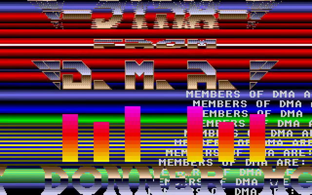
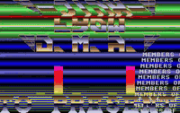

# Raster Master Go

A Go/Ebitengine conversion of **Raster Master**, an Atari ST intro by
**Jinx of DMA**, built with Demo Construction Kit **v1.0.13**.

The original artwork, 32 × 32 and 8 × 7 pixel fonts, messages and animation
tables are decoded from the native executable. The scene combines a deformed
JINX logo, a folded FROM logo, a DMA logo, a large horizontal scrolling, thirteen
authored parallax lanes and several overlapping raster families. Eleven of the
small scrolling lanes are visible in the original 320 × 200 viewport.

DCK owns the sprite crops, scrolling renderers, indexed palette, mirrored music
meters and audio playback. A small production-specific controller preserves
the original lookup-table phases and ordered palette writes. The visual clock
runs at **50 Hz** on desktop and Android, independently of display refresh rate.

<!-- Project showcase -->
## Screenshots

[](docs/media/screenshot-1.png)

Metallic DMA logos, layered rainbow rasters, scrolling text, and music meters.

## Video

[](https://github.com/olivierh59500/go-jinx-rastermaster/raw/refs/heads/main/docs/media/preview.mp4)

**[Watch or download the 24-second MP4 preview with sound](https://github.com/olivierh59500/go-jinx-rastermaster/raw/refs/heads/main/docs/media/preview.mp4)**

This preview is captured from the Go production.

The animated image is silent; the MP4 includes the soundtrack.

<!-- End project showcase -->

## Run

```sh
go run ./cmd/jinxrastermaster
```

- Space, Enter or a mouse click: leave the opening card.
- F1–F10: change the soundtrack.
- H or Insert: toggle the blue background, equivalent to Atari ST Help.
- Escape: exit. Space also exits once the main scene has started.

## Android

```sh
./scripts/run-android.sh
```

Use `--build-only` to build without installing. The script uses Android SDK 36,
NDK 28.2, Java 17 and the included Gradle wrapper. It installs the ARM64 APK on
one authorized USB device and launches **Raster Master**.

Tap the opening card to start. In the main scene, tap the left half to toggle
the background or the right half to select the next soundtrack. Android keeps
the screen awake, handles landscape orientation and suspends the renderer and
audio with the activity lifecycle.

## Soundtracks

Ten replacement YM tracks retain the original ten music selectors. All are
Atari ST arrangements by **Mad Max (Jochen Hippel)**; their original composition
credits are retained in the files. F3 is selected initially, as in the original
intro. These are replacement tracks, rather than a claim that every native
music payload has been reproduced.

| Key | Track |
| --- | --- |
| F1 | Jinx 1 / Jinks theme |
| F2 | Roll out 1 |
| F3 | Roll out 2 |
| F4 | Axel F |
| F5 | Knucklebusters |
| F6 | Eliminator |
| F7 | Great Giana Sisters, in-game tune 2 |
| F8 | Wings of Death, level 1 |
| F9 | Turrican 2, The Desert Rocks |
| F10 | Union Demo, Alloy Run |

DCK detects and decodes the YM content, loops each track and supplies register
snapshots to the six mirrored volume bars. Selecting a track does not restart
the graphic effects. `-mute` disables device audio.

## Verification

```sh
go test ./...
go vet ./...
go test -tags gpu ./internal/demo
go run ./cmd/jinxrastermaster -capture captures -frame 650 -mute
```

Seven 68000 memory checkpoints cover the first scene, the logo cycle, the large
text restart and the parallax table's initial and repeating paths. The reference
model matches the native screen planes and all 200 raster colors at those
checkpoints. The sound-meter plane is excluded because the playlist is replaced.
A GPU test separately compares DCK's logo and font rendering with a native
framebuffer. Lookup bounds are exercised over 12,000 updates.

Capture mode starts the main scene automatically and writes native-resolution
PNG frames. The renderer caches its images and glyph slices; animation does not
allocate new graphics surfaces or read pixels back from the GPU.

## Asset extraction

```sh
go run ./cmd/extract -input /path/to/intro.prg -assets /path/to/export
```

The Go backward-bitstream decoder was verified against the original decoder's
output. The extractor writes only presentation artwork, fonts and parameter
tables. It can optionally save the unpacked executable with `-output` for
inspection. The executable is not needed to run the converted intro.

Android validation: installed and checked on a Pixel 10a. The scene maintains
approximately 50 simulation updates and 60 displayed frames per second, with
about 7–16 MiB of observed Go heap, including audio playback. APK signature and 16 KB ZIP/ELF
alignment checks pass. All ten soundtracks decode and produce non-silent PCM.

## Video export

```sh
go run ./cmd/video
```

This creates a three-minute 50 fps H.264/AAC MP4, a PNG poster and a JSON report
under `recordings/`. DCK exports only the game canvas and its own audio, using
one simulation clock. Graphics are scaled by an integer factor of two. The
recordings are local generated media. Duration and poster time can be changed
with `-duration` and `-poster-at`.

The recording shows the opening card for three seconds before the main scene.
